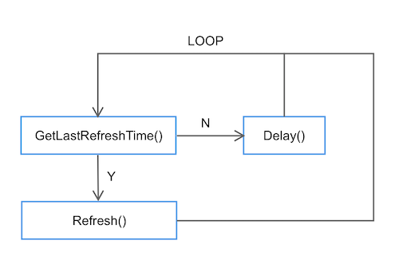

# Simple Worker Example

Simple worker is basic worker type.
You can implement you own worker under `Worker` interface:

```go
type Worker interface {
    Start(strategyId, parameter string)
    Stop(strategyId, parameter string)
}
```

There are two hooks, `Start` and `Stop`, will be invoked during the lifecyle of worker.

You can make it act as a thread, a single triggerred event (any of them or both), etc. .

## Use Case of the Example

We have an e-commence bussiness that there are numbers of merchandise. We have a hot selling
list which is scheduled to refresh every 5 minutes. Though we have better model in goschedule
can reach the point but we implement a delay-execute model this time.



## Strategy Definition

Here is the definition of the strategy for example:

```text
Strategy:{"Id":"HotSellingRefresher","IpList":["127.0.0.1"],"MaxOnSingleScheduler":0,"Total":1,"Kind":1,"Bind":"main.HotSellingRefresher","Parameter":"","Enabled":true,"CronBegin":"","CronEnd":"","Extra":null}
```

You can import it on goschedule-console panel `Import`.

And we use `redis` as the storage of scheduling(127.0.0.1:6379).

## Test

First we can boot up two or more processes of the worker by `go run simple_worker/*.go`.
After `importing` and `resuming` the strategy on console panel we should observe one of the instances
is selected and starts processing. You can try to kill idle instance, working instance and wait to see
the scheduling process(a standby period up to 60 seconds).
